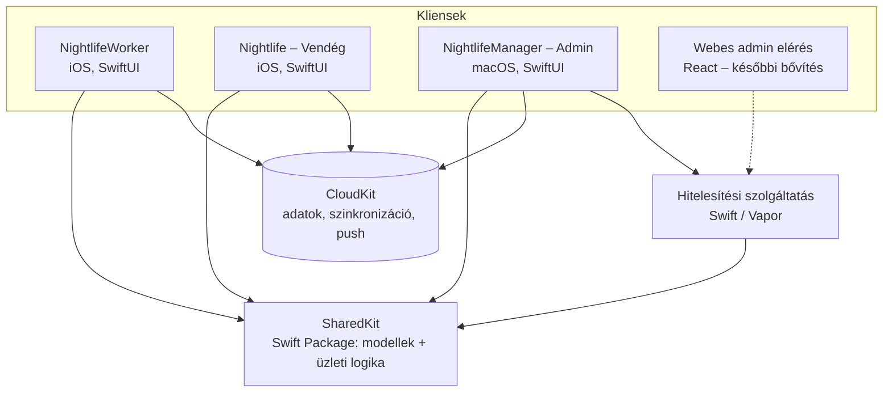

# Rendszerterv
## Készítette Majoros Máté
---
## Rendszer célja

A rendszer célja, hogy megbízható, átlátható és könnyen kezelhető portált nyújtson egy szórakozóhely vezetéséhez, fenntartásához, működtetéséhez és használatához.

## Projektterv

#### Projektszerepkörök, felelősségek:

* Fődizájner: Majoros Máté

* Főtesztelő: Majoros Máté

* Főtervező: Majoros Máté

* Projekt munkások és felelősségek: Majoros Máté

* Backend munkálatok: Majoros Máté

* Frontend munkálatok: Majoros Máté

* Ütemterv:

| Funkció/Story | Feladat/Task | Prioritás | Becslés | Aktuális becslés | Eltelt idő | Hátralévő idő |
|---------------|--------------|-----------|---------|------------------|------------|---------------|
| Bejelentkezés - Worker | Bejelentkezés megvalósítása, welcomeView | 5 | 3 | 0 | 0 | 3 |
| Töltőképernyő - Worker | Töltőképernyő megvalósítása, loadingView | 3 | 1 | 0 | 0 | 1 |
| Kezdőképernyő - Worker | Kezdőképernyő megvalósítása, mainView | 5 | 2 | 0 | 0 | 2 |
| Beosztások - Worker | Beosztásokképernyő megvalósítása, scheduleView, adatbázis létrehozása, összekapcsolása | 4 | 6 | 0 | 0 | 6 |
| Kódolvasó - Worker | Kódolvasóképernyő megvalósítása, readerView, WalletKit implementálása ellenőrzéshez | 4 | 3 | 0 | 0 | 3 |
| Pánikmód - Worker | Pushüzenetek, pánikjelzés, felhő alapú kommunikáció | 2 | 3 | 0 | 0 | 3 |
| Beállítások - Worker | Beállítás menü megvalósítása, settingsView, alapvető alkalmazásbeállítások beépítése, különböző nyelvek implementálása | 2 | 1 | 0 | 0 | 1 |
| Nyelv - Worker | Nyelvfájlok megírása | 1 | 2 | 0 | 0 | 2 |
| Térképképernyő | Térképképernyő megvalósítása, mapView, MapKit integráció* | 3 | 5 | 0 | 0 | 5 |
| Statisztika | Statisztikaképernyő megvalósítása, statView, alkalmazott saját teljesítménye | 3 | 2 | 0 | 0 | 2 |

## Üzleti folyamatok

| Folyamat | Szereplők | Lépések | Követelmények |
|----------|-----------|---------|---------------|
| Helyszín előkészítése | Adminisztrátor | Tervrajz megrajzolása szintenként → zónák, POI-k kijelölése → zóna QR-kódok nyomtatása és kihelyezése | L7 |
| Műszakkiosztás | Adminisztrátor, Munkavállaló | Műszak létrehozása (idő, zóna, létszám, feladatok) → munkavállaló hozzárendelése → ütközés- és létszám-ellenőrzés → a műszak megjelenik a munkavállalónál | L3, K5 |
| Műszakkezdés | Munkavállaló | Bejelentkezés → beosztás megtekintése → zóna-bejelentkezés QR-kóddal | K2, K5, K16 |
| Pánikjelzés | Munkavállaló, Biztonsági személyzet, Adminisztrátor | Pánik mód aktiválása → riasztás a jogosult körnek az utolsó ismert zónával → nyugtázás → megjelenés a kérelmek között | K8, L8 |
| Készlethiány | Munkavállaló, Adminisztrátor | Készletkérés leadása → jóváhagyás/elutasítás → készlet frissítése | K17, L10 |
| Jegyvásárlás és beléptetés | Vendég, Munkavállaló | Esemény kiválasztása → jegyvásárlás → jegy az Apple Tárcába → belépéskor a jegy QR-kódjának beolvasása → jegy felhasználtnak jelölése | L11, M4, K7 |

## Architektúra

| Komponens | Felelősség |
|-----------|------------|
| **SharedKit** | A követelmény-annotációk makrói (`RequirementMacros` makró-cél és `Requirements` könyvtár, swift-syntax; a makrók nem generálnak kódot, csak jelölnek). A kliensek és a hitelesítési szolgáltatás közös adatmodellje és üzleti logikája (pl. műszakütközés, létszámkorlát, készletminimum). Az adminisztrátori fiókok logikája külön, csak Foundationre épülő `AdminCore` célban van, így Linuxon is lefordul, és a szerver is ezt használja; a `SharedKit` könyvtár mindkettőt továbbadja (`@_exported import`). Felülettől független, ezért egységtesztekkel teljesen lefedhető. |
| **Kliensek** | MVVM felépítés: a nézetek (SwiftUI View) csak megjelenítenek, az állapotot és a műveleteket a ViewModellek kezelik, az üzleti szabályokat a SharedKit adja. |
| **Szolgáltatásréteg** | A külső függőségek (hitelesítés, CloudKit, értesítések, kamera) protokollok mögött érhetők el, a ViewModellek ezeket konstruktoron keresztül kapják meg. Tesztben valódi szolgáltatás helyett tesztpéldány (fake) adható át, így a BDD-forgatókönyvek hálózat és Apple-fiók nélkül is futnak. |
| **CloudKit** | Közös adattárolás és szinkronizáció; a nyilvános adatbázis a helyszín- és eseményadatoké, a változásokról (pl. pánikjelzés) feliratkozás alapú push értesítés érkezik. |
| **Hitelesítési szolgáltatás** | Az adminisztrátori fiókok tárolása és kezelése, jelszavas bejelentkezés, tokenkiadás; Swift (Vapor) szerver az `AuthService/` csomagban (ld. Hitelesítés). |

## Adatmodell

A modellek a SharedKit csomagban találhatók. ✅ = létezik, 🔄 = módosítandó, 🆕 = új.

| Modell | Állapot | Fő mezők | Kapcsolatok |
|--------|---------|----------|-------------|
| `WorkerUser` | ✅ | appleID, name, role, payPeriod, workedHours | → `Schedule` |
| `AdminUser` | ✅ | username (az e-mail-cím helyi része), name, role (userAdmin / businessManager / owner), signInMethod, appleID | → `AdminCredential` |
| `GuestUser` | ✅ | appleID, name, tickets | → `Ticket` |
| `Shift` | ✅ | startTime, endTime, capacity, workerIDs, tasks | → `Zone`, → `ShiftTask` |
| `Schedule` | ✅ | workerID, shifts, payPeriod | → `Shift` |
| `ShiftTask` | ✅ | title, description, isCompleted, assignedWorkerIDs, workstation | |
| `Event` | ✅ | title, description, startTime, endTime, location, capacity, ticketOffers, raffle | → `Ticket`, → `TicketOffer`, → `Raffle` |
| `EventCatalog` (értékesítés) | ✅ | `checkAvailability`, `price`, `purchase`, `tickets(of:)`; szabályok: meghirdetett jegytípus, keret és férőhely, az esemény még nem ért véget, 1–10 jegy; a jegyek egyedi `NL-…` sorozatszámot kapnak (M4) | → `Event`, → `Ticket` |
| `TicketOffer` | ✅ | type (`TicketType`), price (Ft), quota (opcionális) (L11, M4) | → `Event` |
| `EventCatalog` | ✅ | events (kezdés szerint rendezve); szabályok: cím kell, a vége a kezdés után, férőhely legalább 1, jegytípus eseményenként egyszer, ár nem negatív, a keretek összege legfeljebb a férőhely (L11) | → `Event` |
| `Ticket` | ✅ | eventID, guestID, ticketType, price, serialNumber, isUsed | → `Event` |
| `PanicAlert` | ✅ | workerID, timestamp, zoneID, isAcknowledged, acknowledgedByID; szabályok: címzettek (jogosult szerepkör, a küldő nélkül), üzenet (név, munkakör, zóna), nyugtázás (csak az első, a sajátját nem) (K8) | → `Zone` |
| `SupplyItem` | ✅ | name, category, quantity, unit, minimumQuantity | |
| `RequestLog` | ✅ | a pánikjelzésekből és a készletkérésekből összeállított napló: kategória, időpont, munkavállaló, részletek, nyitott/lezárt; legfrissebb elöl; kategóriánkénti darabszám; az „elfogyott” kérések sürgősként jelölve (L8, K17) | → `PanicAlert`, → `SupplyRequest` |
| `Inventory` | ✅ | items (név szerint), requests; szabályok: egyedi név, nem negatív mennyiség; alacsony készlet = minimum alatt; jóváhagyás levonja a kért mennyiséget, a készletnél nagyobb kérés nem hagyható jóvá; csak függő kérés bírálható el; egy munkavállalónak tételenként egy nyitott kérése lehet; `categories` (tételek kategóriánként), `requests(of:)` (egy munkavállaló kérései, legfrissebb elöl) (L10, K17) | → `SupplyItem`, → `SupplyRequest` |
| `SupplyRequest` | ✅ | workerID, itemID, quantity, status, note, urgency (`SupplyUrgency`: elfogyott / hamarosan elfogy), zoneID (a kérő zónája); a korábbi mentések a két új mező nélkül is betöltődnek (K17) | → `SupplyItem`, → `Zone` |
| `Venue` | ✅ | name, floors (szint szerint rendezve); szabály: egyedi szintszám, pozitív lapméret; `zoneCodes`, `floor(containingZone:)` (L7) | → `Floor` |
| `Floor` | ✅ | name, level, width és height (méter), zones, pointsOfInterest, walls; pontrács 1 m-enként (`gridSpacing`), `snapped`/`clamped`; szabályok: az alakzat legalább 3 különböző pontból áll, van területe, a lapon belül marad; a fal legalább 2 pontból áll; a zónanév egyedi; az alakzatok fedhetik egymást. Szerkesztés: `item(at:)` (a legfelső alakzat: fal, majd POI, majd zóna, a később rajzolt felül), `move`, `movePoint`, `remove`, ugyanazokkal a szabályokkal (L7) | → `Zone`, → `POI`, → `Wall` |
| `PlanPoint`, `PlanGeometry` | ✅ | pont méterben a lap bal felső sarkától; terület (shoelace), súlypont, pont a sokszögben (konkáv is), távolság a vonaltól (L7) | |
| `Wall` | ✅ | points (töréspontok) (L7) | → `Floor` |
| `Zone` | ✅ | name, outline (sokszög), area, center, qrPayload (`nightlife://zone/<id>`); a korábbi cellás mentés befoglaló téglalapként töltődik be | → `Floor` |
| `POI` | ✅ | name, kind (`POIKind`: bár, mosdó, színpad, bejárat, vészkijárat, ruhatár, egyéni), outline (sokszög), area, center (az ikon helye); a korábbi cellás mentés 1 × 1 m-es négyzetként töltődik be | → `Floor` |
| `ZoneCheckIn` | ✅ | workerID, zoneID, timestamp | → `WorkerUser`, → `Zone` |
| `WorkerPosition` | ✅ | workerID, isOnShift, currentZoneID, checkIns; szabályok: csak műszak alatt, csak ismert zónába (K16, N4) | → `Zone`, → `ZoneCheckIn` |
| `ShiftPlan` | ✅ | staff, shifts; szabályok: a műszak vége a kezdés után, létszám legalább 1, betelt műszakra és átfedő műszakra nincs hozzárendelés, feladat csak a műszakon lévő munkatársnak, eltávolításkor a feladatokról is lekerül (L3) | → `WorkerUser`, `Shift`, `ShiftTask` |
| `WorkerSchedule` | ✅ | egy munkavállaló beosztása a műszaktervből: a saját műszakok időrendben, állapot (lezárult / folyamatban / következő), szint és zóna neve, csak a neki kiosztott feladatok; `current`, `next`, `past` (legfrissebb elöl), `upcomingDays` (a kezdés napja szerint) (K5) | → `Shift`, → `Venue` |
| `StaffMap` | ✅ | a munkatársak pozíciója (legutóbbi zóna-bejelentkezés), munkaterülete és saját feladatai az adott időpontban aktív műszakból; a K6 és az L4 közös számítása | → `WorkerUser`, `ZoneCheckIn`, `Shift`, `ShiftTask` |
| `Raffle` | ✅ | title, prize, details, participantIDs (L11, M7) | → `Event` |
| `AdminDirectory` | ✅ | admins, credentials, companyDomain; szabályok: első tulajdonos, jogosultságok (adminokat a tulajdonos és a felhasználó-adminisztrátor kezel, tulajdonost csak tulajdonos), utolsó tulajdonos, egyedi felhasználónév, jelszószabály, ideiglenes jelszó, domain csak tulajdonostól (L1, L3, L6, N3) | → `AdminUser`, → `AdminCredential` |
| `WorkerFeature` | ✅ | profilePicture (K10), statistics (K12), guide (K15), supplyRequests (K17); az `AdminDirectory.enabledWorkerFeatures` tárolja, alapból mind bekapcsolva; a régebbi mentések a mező nélkül is betölthetők (L6) | |
| `AdminCredential` | ✅ | adminID, salt, hash, mustChangePassword; a hash-függvény a `PasswordHashing` protokoll mögött cserélhető: a Mac helyi módjában PBKDF2-HMAC-SHA256 (600 000 iteráció), a szerveren Bcrypt (N3) | → `AdminUser` |
| `AdminBackend` | ✅ | a Manager és a fiókkezelés közötti aszinkron protokoll: állapot (`AdminSnapshot`), bejelentkezés (`AdminSession`: token, admin, kötelező jelszócsere), fiók- és beállításműveletek; hibái (`AdminBackendError`) Codable-ek, így a HTTP-válaszban is átadhatók. Megvalósításai: `LocalAdminBackend` (actor, tokenek lejárati idővel; a Mac helyi módja és a szerver is ezt futtatja) és `RemoteAdminBackend` (HTTP-kliens a szolgáltatáshoz) (L1, L2, L3, L5, L6) | → `AdminDirectory` |

A meglévő modelleken elvégzett módosítások (egységtesztekkel lefedve):

* `PanicAlert`: a földrajzi koordináták (latitude, longitude) helyett az utolsó ismert zóna (zoneID) kerül tárolásra (K8, N4).
* `Shift`: a szöveges `location` helyett zónahivatkozás (zoneID) (K5, L3).
* `WorkerUser`: a `shifts` mező megszűnt, a műszakok a `Schedule`-ben vannak, így elkerülhető az adatduplikáció.
* `AdminUser`: bejelentkezési mód (`signInMethod`: Sign in with Apple / jelszavas) mező.

Az `AdminCredential` kizárólag a hitelesítési szolgáltatás adatbázisában tárolódik, a CloudKitbe és a kliensekre nem kerül.

## Hitelesítés

| Kliens | Módszer |
|--------|---------|
| Munkavállaló, Vendég | Sign in with Apple; a közös SharedKit-logika (`AuthViewModel`) az Apple-felhasználóazonosítót a `CredentialStoring` protokoll mögött, élesben a Keychainben (`KeychainCredentialStore`, appokként külön szolgáltatásnévvel, csak ezen az eszközön, az első feloldás után elérhető) tárolja; indításkor a tárolt bejelentkezés visszatöltődik, kijelentkezéskor törlődik (K2, K4, K14, M2, M3). |
| Adminisztrátor | Sign in with Apple **vagy** jelszavas bejelentkezés; a felhasználónév az e-mail-cím helyi része, a domain a `CompanySettings`-ből jön (L1, L6). |

A CloudKit nem biztosít saját jelszavas fiókkezelést, ezért a jelszavas bejelentkezéshez külön megoldás szükséges:

| Lehetőség | Leírás | Előny | Hátrány |
|-----------|--------|-------|---------|
| A) CloudKit-rekord | A jelszó hash-e CloudKit-rekordban, ellenőrzés a kliensen | Nincs külön szerver | A hash a kliensre kerül, ami gyengébb biztonságot jelent; a webes elérést nem szolgálja ki |
| B) Saját hitelesítési szolgáltatás | Kis szerveroldali szolgáltatás (Swift / Vapor), amely a hasht tárolja és ellenőrzi, sikeres belépéskor tokent ad | A hash nem hagyja el a szervert; a későbbi React-os webes elérés is erre épülhet | Üzemeltetendő szerver |

**Választott megoldás:** B) Saját hitelesítési szolgáltatás. A szolgáltatás Swiftben (Vapor) készül, így a SharedKit modelljei szerveroldalon is felhasználhatók. A jelszavak sóval ellátott, erős hash-függvénnyel képzett formában kizárólag a szerveren tárolódnak (ld. N3); sikeres bejelentkezéskor a szolgáltatás lejárati idővel rendelkező tokent ad, amelyet a kliens a Keychainben tárol. A későbbi React-os webes adminisztrátori elérés ugyanezt a szolgáltatást használja.

**Megvalósítás:**

* A szolgáltatás (`AuthService/`, Vapor 4) a SharedKit `AdminCore` céljának `LocalAdminBackend`-jét futtatja HTTP mögött, így a szabályok (első tulajdonos, jogosultságok, ideiglenes jelszó, domain) a szerveren és a Mac helyi módjában azonosak. A jelszavak Bcrypt-hash-sel, a fiókok egy JSON-fájlban (`AUTH_DATA_FILE`) tárolódnak; a tokenek a memóriában vannak, 12 óra után lejárnak, újraindításkor érvénytelenné válnak.
* A Manager a `Hitelesítés` beállításban választ: üres címmel helyi mód (a fiókok a Mac `admins.json` fájljában, PBKDF2-hash-sel — fejlesztéshez és bemutatáshoz), megadott címmel a szolgáltatás (`RemoteAdminBackend`). A cím a felhasználói beállításokban (`AuthServiceURL`) marad meg.
* A token `Authorization: Bearer <token>` fejlécben utazik. Hiba esetén a válasz törzse a JSON-kódolt `AdminBackendError`, amelyet a kliens visszaalakít, így a felület ugyanazt az üzenetet mutatja helyi és távoli módban.

| Metódus és útvonal | Token | Leírás | Siker |
|--------------------|-------|--------|-------|
| `GET /status` | – | Be van-e állítva tulajdonos, a domain és a munkavállalói funkciók (adminlista nélkül) | 200 |
| `POST /setup` | – | Az első tulajdonos létrehozása (csak egyszer) | 200, session |
| `POST /sessions` | – | Jelszavas bejelentkezés | 200, session |
| `POST /sessions/apple` | – | Sign in with Apple-azonosító összekapcsolása, bejelentkezés | 200, session |
| `DELETE /sessions` | ✔ | Kijelentkezés (a token érvénytelenítése) | 200 |
| `GET /directory` | ✔ | Teljes állapot az adminlistával | 200 |
| `PUT /me/password` | ✔ (ideiglenes is) | Az ideiglenes jelszó lecserélése | 200, session |
| `POST /me/password/change` | ✔ | Saját jelszó módosítása a jelenlegivel | 200 |
| `POST /admins` | ✔ | Adminisztrátor felvétele | 200 |
| `DELETE /admins/:id` | ✔ | Adminisztrátor eltávolítása | 200 |
| `PUT /admins/:id/password` | ✔ | Jelszó visszaállítása ideiglenesre | 200 |
| `PUT /settings/domain` | ✔ | Vállalati domain (csak tulajdonos) | 200 |
| `PUT /settings/features/:feature` | ✔ | Munkavállalói funkció ki- és bekapcsolása | 200 |

Hibakódok: hiányzó, lejárt vagy ismeretlen token, hibás jelszó: 401; ideiglenes jelszóval más művelet vagy hiányzó jogosultság: 403; ismeretlen adminisztrátor: 404; foglalt felhasználónév, már beállított tulajdonos, utolsó tulajdonos: 409; egyéb érvénytelen adat: 400.

## Értesítések és pánik mód

* A pánikjelzés `PanicAlert` rekordként jön létre a CloudKitben; a jogosult kör eszközei feliratkozás (subscription) alapján push értesítést kapnak.
* A megkülönböztethető hanghoz egyedi értesítési hang tartozik. A néma módot is áttörő „kritikus figyelmeztetés” (Critical Alert) külön Apple-engedélyhez kötött; amíg ez nincs meg, időérzékeny (time-sensitive) értesítés kerül alkalmazásra.
* A nyugtázás a rekord `isAcknowledged`, `acknowledgedByID` és `acknowledgedTimestamp` mezőit tölti ki; csak az első nyugtázás érvényes, a küldő a saját riasztását nem nyugtázhatja.
* A küldés a `PanicAlertSending` protokoll mögött történik (első szolgáltatás a szolgáltatásrétegben): élesben CloudKit-rekord és push értesítés, tesztben rögzítő tesztpéldány.
* Az értesítendő szerepkörök alapértelmezetten a biztonsági személyzet; ez az L6 beállításaiból bővíthető.

## Helyszíntervező és QR-kódok

* Minden szint egy méterben megadott méretű lap, 1 m-enként halvány szürke pontráccsal (az Apple Freeform alapvásznához hasonlóan). A zónák és a POI-k sokszögek (a POI-nak is van kiterjedése, az ikonja a súlypontjában van), a falak töréspontos vonalak. Az alakzatok fedhetik egymást.
* A megjelenítés a SharedKit `FloorPlanView` nézetével (SwiftUI Canvas, adott méretarány pont/méter) történik, amelyet a szerkesztő (L7) és a térképek (K6, L4, M5) közösen használnak; MapKit nem szükséges. A telefonos térképek a tervrajzot a képernyő szélességéhez igazítják (`fittingScale`).
* A szerkesztő eszközei: kijelölés, sokszög és fal. A sokszög pontonként készül, és az első pontra kattintva vagy Enterrel zárul, utána választható ki a típusa (zóna vagy POI-típus) és a neve. A pontok alapból a legközelebbi rácsponthoz illeszkednek, ez kikapcsolható. Kijelöléskor a legfelső alakzat választódik ki, amely mozgatható, a sarokpontjai áthelyezhetők, és törölhető. A rajzolás állapota (eszköz, félkész pontok, kijelölés) a `VenueDesignerViewModel`-ben van, így a BDD-forgatókönyvek a felület nélkül is lefedik. A hibás szerkesztés (kevés pont, terület nélküli alakzat, lapon kívül, ismétlődő zónanév) elutasításra kerül, és a helyszín változatlan marad.
* A helyszín, a műszakterv és az eseménykatalógus mentése a `VenueStoring`, a `ShiftPlanStoring`, illetve az `EventCatalogStoring` protokoll mögött történik; amíg nincs CloudKit (N2), a közös `LocalJSONStore` JSON-fájlba ment (Application Support: `venue.json`, `shift-plan.json`, `events.json`). A személyzeti térkép (L4) a műszakterv munkatársait és műszakjait használja.
* A vendég térkép (M5) a helyszín vendégeknek szűrt változatát kapja (`Venue.forGuests`): a zónák (a személyzet munkaterületei) és az egyéni típusú, belső pontok (pl. raktár) nem jelennek meg, csak a bár, mosdó, színpad, bejárat, vészkijárat és ruhatár, valamint a falak. A térkép a földszinten (0. szint, ennek hiányában a hozzá legközelebbi szinten) nyílik (`Venue.groundFloor`).
* A zónakódlap a zónák QR-kódjait szint és név szerint rendezve, „Szint – Zóna” felirattal, nyomtatható formában jeleníti meg.
* A zóna QR-kódjának tartalma a zóna azonosítója egy alkalmazásspecifikus formátumban (pl. `nightlife://zone/<zoneID>`); a kódolvasó (K7) a formátum alapján különbözteti meg a zóna-, jegy- és egyéb kódokat.
* A jegyvásárlás a fizetést a `PaymentProcessing` protokollon keresztül végzi: előbb a rendelkezésre állás ellenőrzése, majd a terhelés, végül a jegyek kiadása; elutasított fizetésnél nem keletkezik jegy. Amíg nincs Apple Pay (fizetős fiók), Debug buildben tesztfizetés, Release-ben „a fizetés még nem elérhető” működik. A vendég azonosítója az Apple-felhasználóazonosítóból képzett stabil UUID (`GuestUser.stableID`, SHA-256).
* A jegyek QR-kódja a jegy sorozatszámát tartalmazza (`nightlife://ticket/<sorozatszám>`); beléptetéskor a rendszer ellenőrzi, hogy a jegy létezik-e, a megfelelő eseményhez tartozik-e, és nincs-e már felhasználva (`Ticket.admit(toEvent:)`).
* A beolvasott kód jelentését a SharedKit `ScannedCode` típusa határozza meg (zóna, jegy, ismeretlen); a kódolvasó (K7) ez alapján irányítja a beolvasást a beléptetéshez vagy a zóna-bejelentkezéshez.
* A jegyek és vendégek elérése a `TicketRepository` protokoll mögött történik; amíg a CloudKit-szinkron (N2) nem készül el, a `LocalTicketRepository` memóriabeli megvalósítás szolgálja ki az appot és a teszteket.
* A kamerás olvasás a VisionKit `DataScannerViewController`-ével történik (egy- és kétdimenziós kódok).

## Tesztarchitektúra

A tesztelés részletei a Teszttervben találhatók. A tervezést érintő szabályok:

* Az üzleti logika a SharedKitben van, felülettől függetlenül egységtesztelhető (TDD).
* A ViewModellek a külső szolgáltatásokat protokollon keresztül kapják, így a BDD-forgatókönyvek tesztpéldányokkal, determinisztikusan futnak.
* Minden kliensnek van egységteszt-, BDD- és UI-teszt célja (target).
* A hitelesítési szolgáltatás logikáját az `AdminCoreTests` (`LocalAdminBackendTests`: tokenkiadás, lejárat, ideiglenes jelszó, kijelentkezés) teszteli; a HTTP-réteget az `AuthService` XCTVapor-tesztjei (státuszkódok, Bearer token, a `RemoteAdminBackend` egy valódi, futó szerver ellen). A CI ezeket Linuxon futtatja.

## Fizikai környezet és telepítés

* Fejlesztés: macOS 27, Xcode; célplatform iOS 27 és macOS 27.
* Terjesztés: Apple Developer Program, TestFlight a tesztelőknek.
* CloudKit-tároló fejlesztői és éles környezettel; az adatséma a fejlesztői környezetből kerül át az élesbe.
* A hitelesítési szolgáltatás (Vapor) egy szerveren vagy felhőszolgáltatónál fut, HTTPS-kapcsolaton keresztül érhető el (TLS-t lezáró fordított proxy vagy a szolgáltató HTTPS-végpontja mögött). Linuxon és macOS-en is fordul; beállítása környezeti változókkal: `HOST` (alapértelmezés `127.0.0.1`), `PORT` (`8080`), `AUTH_DATA_FILE` (`data/admins.json`, tartós kötetre kell tenni). Helyi futtatás: `cd AuthService && swift run Run`.
* Verziókezelés: Git; a fő ág mindig sikeres tesztekkel rendelkezik (ld. Tesztterv – Definition of Done).

## Karbantartás

* Az új iOS- és macOS-verziókhoz igazodó frissítések.
* A CloudKit-séma változásai csak visszafelé kompatibilis módon (új mezők hozzáadásával) történnek.
* A CucumberSwift helyi változata a `CucumberSwiftPatched.patch` alapján újra elkészíthető egy újabb hivatalos verzióból.
* Új hiba javítása előtt reprodukáló teszt készül (ld. Tesztterv).
