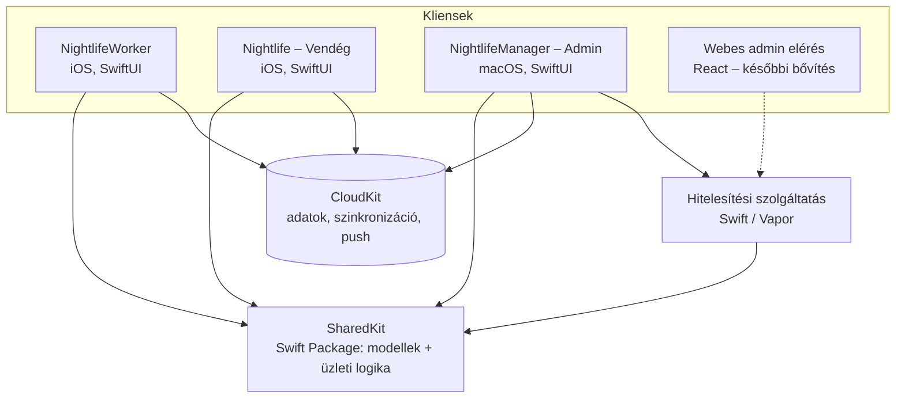

# Rendszerterv
## Készítette Majoros Máté
---
## Rendszer célja

A rendszer célja, hogy megbízható, átlátható és könnyen kezelhető portált nyújtson egy szórakozóhely vezetéséhez, fenntartásához, működtetéséhez és használatához.

## Projektterv

#### Projektszerepkörök, felelősségek:

* Fődizájner: Majoros Máté

* Főtesztelő: Majoros Máté

* Főtervező: Majoros Máté

* Projekt munkások és felelősségek: Majoros Máté

* Backend munkálatok: Majoros Máté

* Frontend munkálatok: Majoros Máté

* Ütemterv:

| Funkció/Story | Feladat/Task | Prioritás | Becslés | Aktuális becslés | Eltelt idő | Hátralévő idő |
|---------------|--------------|-----------|---------|------------------|------------|---------------|
| Bejelentkezés - Worker | Bejelentkezés megvalósítása, welcomeView | 5 | 3 | 0 | 0 | 3 |
| Töltőképernyő - Worker | Töltőképernyő megvalósítása, loadingView | 3 | 1 | 0 | 0 | 1 |
| Kezdőképernyő - Worker | Kezdőképernyő megvalósítása, mainView | 5 | 2 | 0 | 0 | 2 |
| Beosztások - Worker | Beosztásokképernyő megvalósítása, scheduleView, adatbázis létrehozása, összekapcsolása | 4 | 6 | 0 | 0 | 6 |
| Kódolvasó - Worker | Kódolvasóképernyő megvalósítása, readerView, WalletKit implementálása ellenőrzéshez | 4 | 3 | 0 | 0 | 3 |
| Pánikmód - Worker | Pushüzenetek, pánikjelzés, felhő alapú kommunikáció | 2 | 3 | 0 | 0 | 3 |
| Beállítások - Worker | Beállítás menü megvalósítása, settingsView, alapvető alkalmazásbeállítások beépítése, különböző nyelvek implementálása | 2 | 1 | 0 | 0 | 1 |
| Nyelv - Worker | Nyelvfájlok megírása | 1 | 2 | 0 | 0 | 2 |
| Térképképernyő | Térképképernyő megvalósítása, mapView, MapKit integráció* | 3 | 5 | 0 | 0 | 5 |
| Statisztika | Statisztikaképernyő megvalósítása, statView, alkalmazott saját teljesítménye | 3 | 2 | 0 | 0 | 2 |

## Üzleti folyamatok

| Folyamat | Szereplők | Lépések | Követelmények |
|----------|-----------|---------|---------------|
| Helyszín előkészítése | Adminisztrátor | Tervrajz megrajzolása szintenként → zónák, POI-k kijelölése → zóna QR-kódok nyomtatása és kihelyezése | L7 |
| Műszakkiosztás | Adminisztrátor, Munkavállaló | Műszak létrehozása (idő, zóna, létszám, feladatok) → munkavállaló hozzárendelése → ütközés- és létszám-ellenőrzés → a műszak megjelenik a munkavállalónál | L3, K5 |
| Műszakkezdés | Munkavállaló | Bejelentkezés → beosztás megtekintése → zóna-bejelentkezés QR-kóddal | K2, K5, K16 |
| Pánikjelzés | Munkavállaló, Biztonsági személyzet, Adminisztrátor | Pánik mód aktiválása → riasztás a jogosult körnek az utolsó ismert zónával → nyugtázás → megjelenés a kérelmek között | K8, L8 |
| Készlethiány | Munkavállaló, Adminisztrátor | Készletkérés leadása → jóváhagyás/elutasítás → készlet frissítése | K17, L10 |
| Jegyvásárlás és beléptetés | Vendég, Munkavállaló | Esemény kiválasztása → jegyvásárlás → jegy az Apple Tárcába → belépéskor a jegy QR-kódjának beolvasása → jegy felhasználtnak jelölése | L11, M4, K7 |

## Architektúra

| Komponens | Felelősség |
|-----------|------------|
| **SharedKit** | A kliensek és a hitelesítési szolgáltatás közös adatmodellje és üzleti logikája (pl. műszakütközés, létszámkorlát, készletminimum). Felülettől független, ezért egységtesztekkel teljesen lefedhető. |
| **Kliensek** | MVVM felépítés: a nézetek (SwiftUI View) csak megjelenítenek, az állapotot és a műveleteket a ViewModellek kezelik, az üzleti szabályokat a SharedKit adja. |
| **Szolgáltatásréteg** | A külső függőségek (hitelesítés, CloudKit, értesítések, kamera) protokollok mögött érhetők el, a ViewModellek ezeket konstruktoron keresztül kapják meg. Tesztben valódi szolgáltatás helyett tesztpéldány (fake) adható át, így a BDD-forgatókönyvek hálózat és Apple-fiók nélkül is futnak. |
| **CloudKit** | Közös adattárolás és szinkronizáció; a nyilvános adatbázis a helyszín- és eseményadatoké, a változásokról (pl. pánikjelzés) feliratkozás alapú push értesítés érkezik. |
| **Hitelesítési szolgáltatás** | Az adminisztrátorok jelszavas bejelentkezése, tokenkiadás; Swift (Vapor) szerver (ld. Hitelesítés). |

## Adatmodell

A modellek a SharedKit csomagban találhatók. ✅ = létezik, 🔄 = módosítandó, 🆕 = új.

| Modell | Állapot | Fő mezők | Kapcsolatok |
|--------|---------|----------|-------------|
| `WorkerUser` | ✅ | appleID, name, role, payPeriod, workedHours | → `Schedule` |
| `AdminUser` | ✅ | email, name, role (userAdmin / businessManager / owner), bejelentkezési mód | → `AdminCredential` |
| `GuestUser` | ✅ | appleID, name, tickets | → `Ticket` |
| `Shift` | ✅ | startTime, endTime, capacity, workerIDs, tasks | → `Zone`, → `Task` |
| `Schedule` | ✅ | workerID, shifts, payPeriod | → `Shift` |
| `Task` | ✅ | title, description, isCompleted, assignedWorkerIDs, workstation | |
| `Event` | ✅ | title, description, startTime, endTime, location, capacity | → `Ticket`, → `Venue` |
| `Ticket` | ✅ | eventID, guestID, ticketType, price, serialNumber, isUsed | → `Event` |
| `PanicAlert` | ✅ | workerID, timestamp, isAcknowledged, acknowledgedByID | → `Zone` |
| `SupplyItem` | ✅ | name, category, quantity, unit, minimumQuantity | |
| `SupplyRequest` | ✅ | workerID, itemID, quantity, status | → `SupplyItem` |
| `Venue` | 🆕 | name, address | → `Floor` |
| `Floor` | 🆕 | name, level, gridWidth, gridHeight | → `Zone`, → `POI` |
| `Zone` | ✅ | name, cells (`GridCell` halmaz), qrPayload (`nightlife://zone/<id>`) | → `Floor` |
| `POI` | 🆕 | name, type (bár, mosdó, színpad…), cell | → `Floor` |
| `ZoneCheckIn` | ✅ | workerID, zoneID, timestamp | → `WorkerUser`, → `Zone` |
| `WorkerPosition` | ✅ | workerID, isOnShift, currentZoneID, checkIns; szabályok: csak műszak alatt, csak ismert zónába (K16, N4) | → `Zone`, → `ZoneCheckIn` |
| `Raffle` | 🆕 | eventID, title, description, participants | → `Event` |
| `CompanySettings` | 🆕 | companyDomain | |
| `AdminCredential` | 🆕 | adminID, username, passwordHash, salt, mustChangePassword | → `AdminUser` |

A meglévő modelleken elvégzett módosítások (egységtesztekkel lefedve):

* `PanicAlert`: a földrajzi koordináták (latitude, longitude) helyett az utolsó ismert zóna (zoneID) kerül tárolásra (K8, N4).
* `Shift`: a szöveges `location` helyett zónahivatkozás (zoneID) (K5, L3).
* `WorkerUser`: a `shifts` mező megszűnt, a műszakok a `Schedule`-ben vannak, így elkerülhető az adatduplikáció.
* `AdminUser`: bejelentkezési mód (`signInMethod`: Sign in with Apple / jelszavas) mező.

Az `AdminCredential` kizárólag a hitelesítési szolgáltatás adatbázisában tárolódik, a CloudKitbe és a kliensekre nem kerül.

## Hitelesítés

| Kliens | Módszer |
|--------|---------|
| Munkavállaló, Vendég | Sign in with Apple; az azonosító a Keychainben tárolódik, indításkor a hitelesítési állapot ellenőrzésre kerül (K2, K4, M2, M3). |
| Adminisztrátor | Sign in with Apple **vagy** jelszavas bejelentkezés; a felhasználónév az e-mail-cím helyi része, a domain a `CompanySettings`-ből jön (L1, L6). |

A CloudKit nem biztosít saját jelszavas fiókkezelést, ezért a jelszavas bejelentkezéshez külön megoldás szükséges:

| Lehetőség | Leírás | Előny | Hátrány |
|-----------|--------|-------|---------|
| A) CloudKit-rekord | A jelszó hash-e CloudKit-rekordban, ellenőrzés a kliensen | Nincs külön szerver | A hash a kliensre kerül, ami gyengébb biztonságot jelent; a webes elérést nem szolgálja ki |
| B) Saját hitelesítési szolgáltatás | Kis szerveroldali szolgáltatás (Swift / Vapor), amely a hasht tárolja és ellenőrzi, sikeres belépéskor tokent ad | A hash nem hagyja el a szervert; a későbbi React-os webes elérés is erre épülhet | Üzemeltetendő szerver |

**Választott megoldás:** B) Saját hitelesítési szolgáltatás. A szolgáltatás Swiftben (Vapor) készül, így a SharedKit modelljei szerveroldalon is felhasználhatók. A jelszavak sóval ellátott, erős hash-függvénnyel képzett formában kizárólag a szerveren tárolódnak (ld. N3); sikeres bejelentkezéskor a szolgáltatás lejárati idővel rendelkező tokent ad, amelyet a kliens a Keychainben tárol. A későbbi React-os webes adminisztrátori elérés ugyanezt a szolgáltatást használja.

## Értesítések és pánik mód

* A pánikjelzés `PanicAlert` rekordként jön létre a CloudKitben; a jogosult kör eszközei feliratkozás (subscription) alapján push értesítést kapnak.
* A megkülönböztethető hanghoz egyedi értesítési hang tartozik. A néma módot is áttörő „kritikus figyelmeztetés” (Critical Alert) külön Apple-engedélyhez kötött; amíg ez nincs meg, időérzékeny (time-sensitive) értesítés kerül alkalmazásra.
* A nyugtázás a rekord `isAcknowledged`, `acknowledgedByID` és `acknowledgedTimestamp` mezőit tölti ki.

## Helyszíntervező és QR-kódok

* Minden szint egy `gridWidth × gridHeight` méretű rács; a zónák rácscellák halmazai, a POI-k egy-egy cellán helyezkednek el.
* A megjelenítés és a szerkesztés SwiftUI-jal (Grid / Canvas) történik, MapKit nem szükséges.
* A zóna QR-kódjának tartalma a zóna azonosítója egy alkalmazásspecifikus formátumban (pl. `nightlife://zone/<zoneID>`); a kódolvasó (K7) a formátum alapján különbözteti meg a zóna-, jegy- és egyéb kódokat.
* A jegyek QR-kódja a jegy sorozatszámát tartalmazza; beléptetéskor a rendszer ellenőrzi, hogy a jegy létezik-e, a megfelelő eseményhez tartozik-e, és nincs-e már felhasználva.

## Tesztarchitektúra

A tesztelés részletei a Teszttervben találhatók. A tervezést érintő szabályok:

* Az üzleti logika a SharedKitben van, felülettől függetlenül egységtesztelhető (TDD).
* A ViewModellek a külső szolgáltatásokat protokollon keresztül kapják, így a BDD-forgatókönyvek tesztpéldányokkal, determinisztikusan futnak.
* Minden kliensnek van egységteszt-, BDD- és UI-teszt célja (target).
* A hitelesítési szolgáltatás saját egységtesztekkel rendelkezik (jelszó-ellenőrzés, tokenkiadás, ideiglenes jelszó).

## Fizikai környezet és telepítés

* Fejlesztés: macOS 27, Xcode; célplatform iOS 27 és macOS 27.
* Terjesztés: Apple Developer Program, TestFlight a tesztelőknek.
* CloudKit-tároló fejlesztői és éles környezettel; az adatséma a fejlesztői környezetből kerül át az élesbe.
* A hitelesítési szolgáltatás (Vapor) egy szerveren vagy felhőszolgáltatónál fut, HTTPS-kapcsolaton keresztül érhető el.
* Verziókezelés: Git; a fő ág mindig sikeres tesztekkel rendelkezik (ld. Tesztterv – Definition of Done).

## Karbantartás

* Az új iOS- és macOS-verziókhoz igazodó frissítések.
* A CloudKit-séma változásai csak visszafelé kompatibilis módon (új mezők hozzáadásával) történnek.
* A CucumberSwift helyi változata a `CucumberSwiftPatched.patch` alapján újra elkészíthető egy újabb hivatalos verzióból.
* Új hiba javítása előtt reprodukáló teszt készül (ld. Tesztterv).
